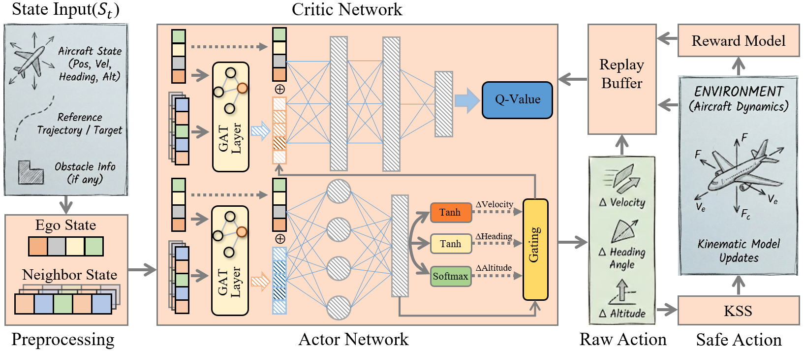

# SARL: Structure-Aligned Reinforcement Learning ✈️

[](https://opensource.org/licenses/MIT)
[](https://www.python.org/)
[](https://pytorch.org/)
[](https://github.com/TUDelft-CNS-ATM/bluesky)

This repository contains the official PyTorch implementation for the paper:  
**SARL: Structure-Aligned Reinforcement Learning for Bridging the Perception-Action Gap in Airspace**

## 📖 Introduction

**SARL** is a specialized Multi-Agent Reinforcement Learning (MARL) framework designed for **autonomous conflict resolution** in ultra-high-density airspace.

Existing approaches often suffer from a **Structural Misalignment** between the RL model architecture and the aviation domain:
1.  **Perception Gap:** Naive state concatenation fails to capture dynamic topologies and lacks physical inductive biases.
2.  **Action Gap:** Dense, coupled control outputs violate the sparse, decoupled nature of Air Traffic Control (ATC) instructions.

**SARL bridges this gap via three core components:**
* **PERG (Physics-Encoded Relational Graph):** An ego-centric graph attention mechanism embedded with physical constraints (e.g., CPA, cylindrical protection zones) for zero-shot scalability.
* **SC-MoE (Sparse Cognitive Mixture-of-Experts):** A differentiable routing mechanism (Gumbel-Softmax) that decouples actions into semantic primitives (Speed, Heading, Altitude, Hold), enforcing strict command sparsity.
* **KSS (Kinematic Safety Shield):** A curriculum-integrated guidance system that shapes the safety envelope during training.

<p align="center">
  
  <br>
  <em>Figure 1: Overview of the SARL Framework.</em>
</p>

## ✨ Key Features

- **Scalability:** Handles variable numbers of aircraft (zero-shot transfer from 5 to 50+ agents).
- **Safety Assurance:** Near-zero collision rates in simulations via KSS guidance.
- **Operational Sparsity:** Aligns with ATC standards by minimizing unnecessary control interventions (low Operational Cost).

## 🛠️ Installation

### 1. Clone the repository
```bash
git clone https: //anonymous.4open.science/r/SARL-D713
cd SARL
```

### 2. Environment Setup
We recommend using Conda to manage dependencies.
```bash
conda create -n sarl python=3.9
conda activate sarl

# Install other requirements
pip install -r requirements.txt
```

## 🚀 Usage
### Training
To train the SARL agent from scratch using the curriculum strategy:
```bash
python BlueSky.py --sim --detached --scenfile Route1.scn
```

## 🙏 Acknowledgements
[BlueSky ATM Simulator](https://github.com/TUDelft-CNS-ATM/bluesky) for the high-fidelity simulation environment.
